# BursaMind 🏙️

BursaMind is a professional smart city reporting and municipal response management platform specifically designed for the city of Bursa. It empowers citizens to report urban issues efficiently and provides municipality staff with intelligent triage and routing tools to manage these reports.

## Live Demo

You can try the live version of BursaMind here:

[Open BursaMind](https://bursamind-alpha.vercel.app)

## 📋 Project Overview

BursaMind bridges the gap between citizens and local government using artificial intelligence and location-aware services. Citizens can submit detailed reports including descriptions, photos, and precise map locations. The system automatically analyzes these reports using the Gemini AI API to determine the appropriate department, risk level, and emergency priority.

## ✨ Features

- **Role-Based Access**: Specialized dashboards for both **Citizens** and **Municipality Staff**.
- **Public Registration**: Open sign-up flow for both citizens and municipal personnel (MVP demo mode).
- **Report Submission**: Easy-to-use form with photo upload (powered by Supabase Storage).
- **Intelligent Location Selection**:
  - Support for current GPS location.
  - Manual map selection via Leaflet.
  - **Bursa-only boundary validation** to ensure data quality.
- **AI-Powered Analysis**:
  - Integration with **Google Gemini Pro API**.
  - **Rule-based fallback engine** for resilience.
  - Robust **Turkish normalization** (tolerant to English-keyboard typing, e.g., "patladi" vs "patladı").
  - Automated risk scoring and priority classification.
- **Municipal Management Dashboard**:
  - Real-time report list with status and priority filtering.
  - Report status management (Pending, In Review, Resolved, Rejected).
  - Official response messaging to citizens.
- **Advanced Routing**:
  - Automatic calculation of the **nearest relevant municipal service point**.
  - Real-world driving route display via **OSRM (Open Source Routing Machine)**.
  - Interactive route maps showing the path from the incident to the intervention unit.

## 🛠️ Tech Stack

- **Frontend**: Next.js 14+ (App Router), TypeScript, Tailwind CSS
- **Backend/Auth**: Supabase (PostgreSQL, Auth, Storage)
- **AI**: Google Gemini API
- **Maps API**: Leaflet, React Leaflet, OpenStreetMap
- **Routing**: OSRM (Open Source Routing Machine)

## 📸 Screenshots

### Landing Page
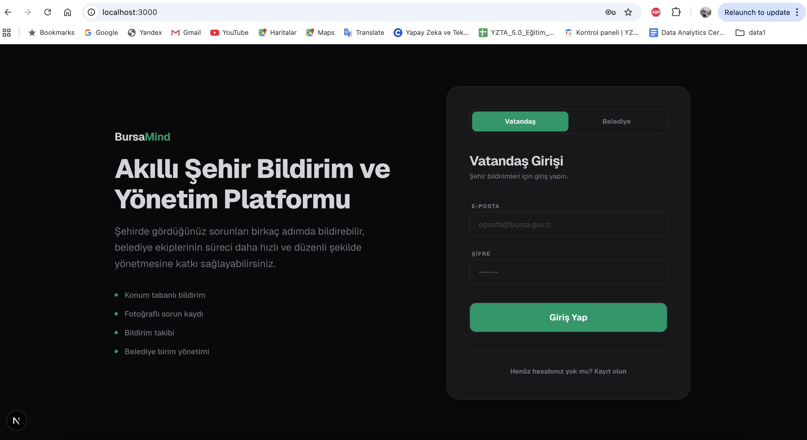

### Citizen Dashboard
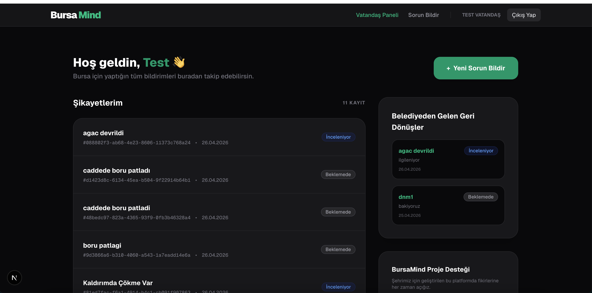
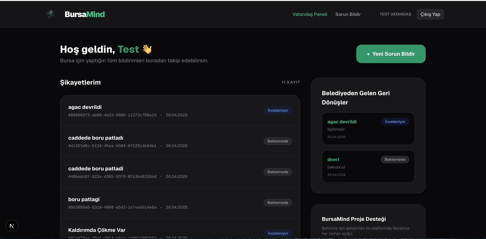

### Report Submission
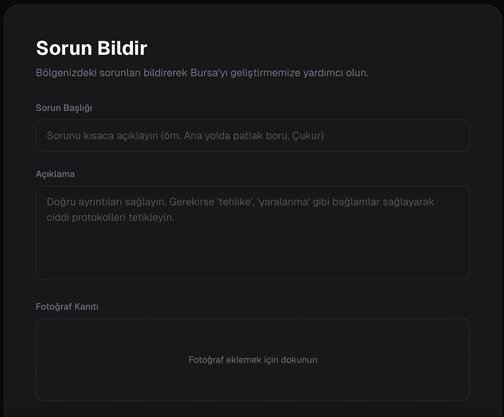
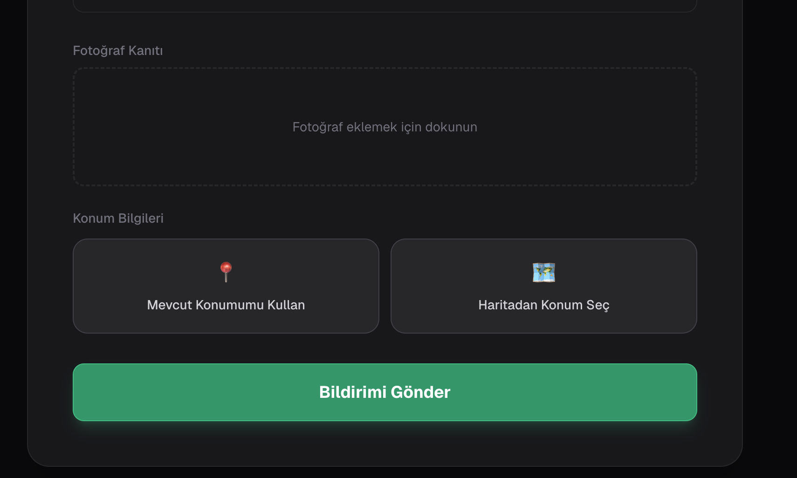
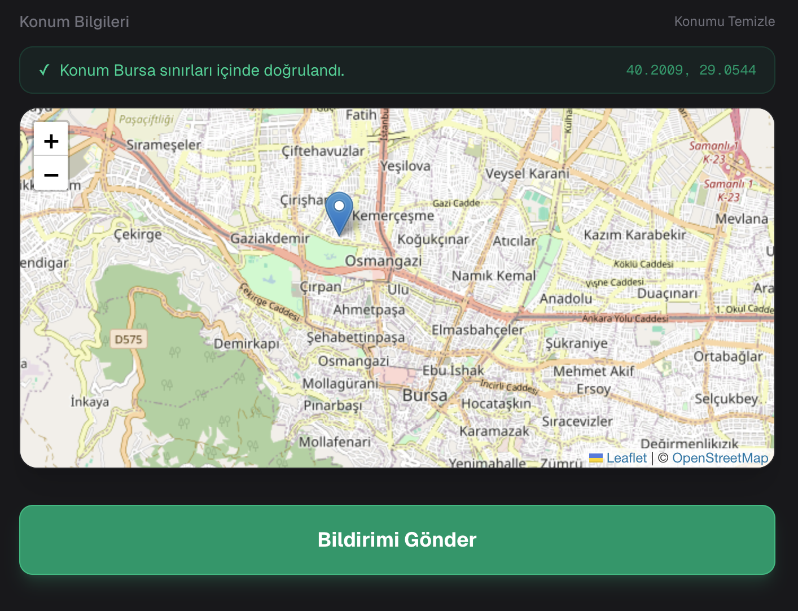

### Municipality Dashboard
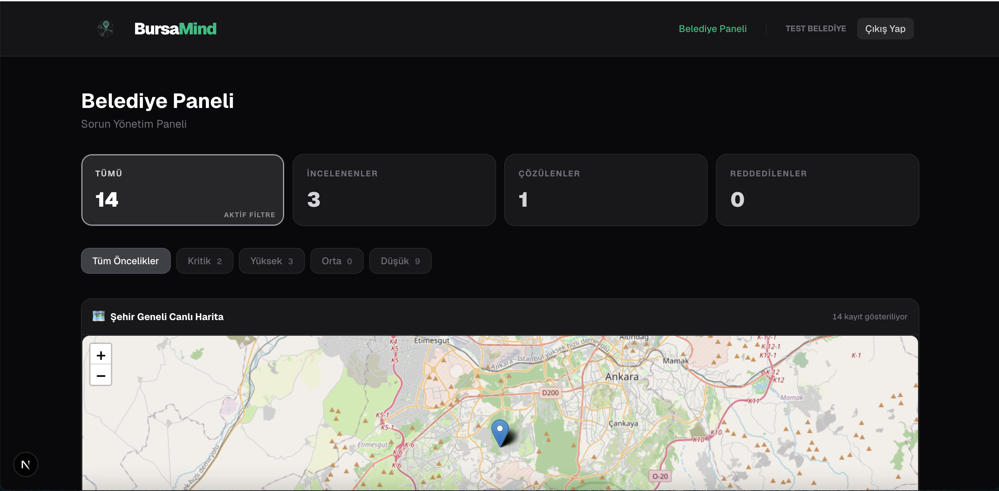
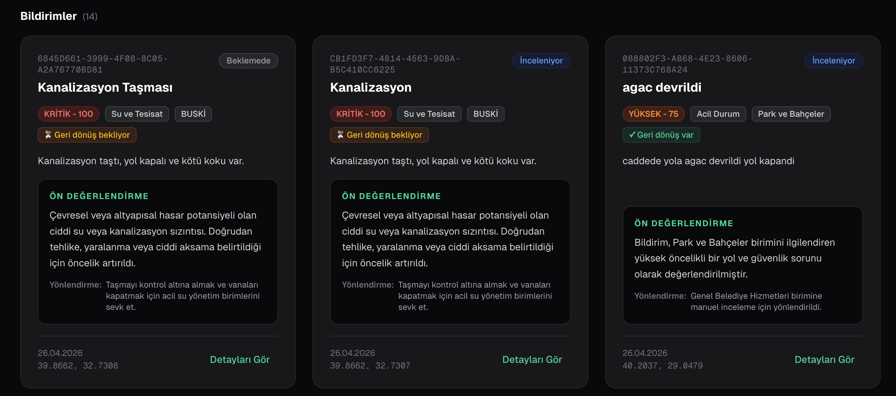
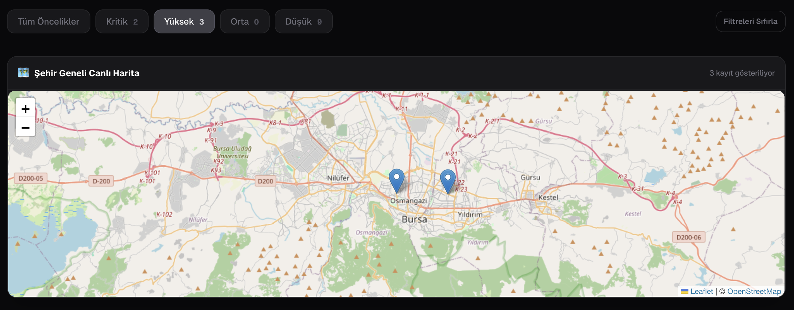

### Report Detail and Routing
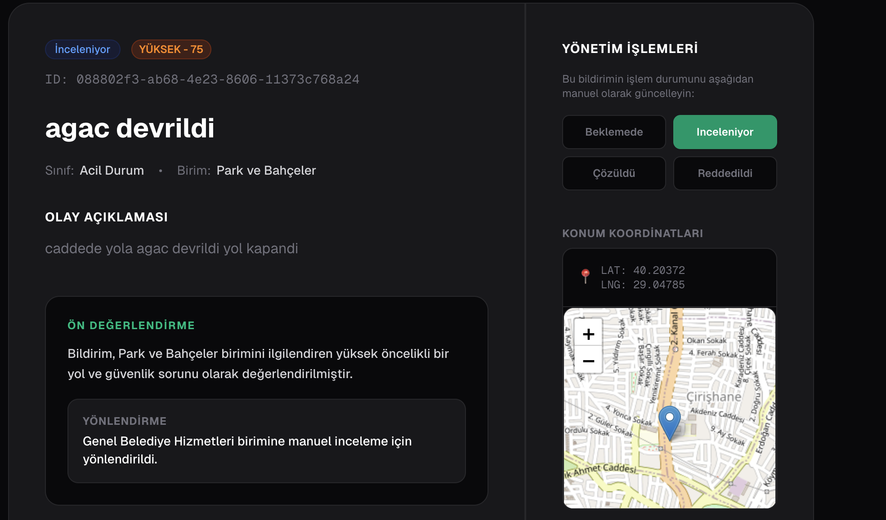
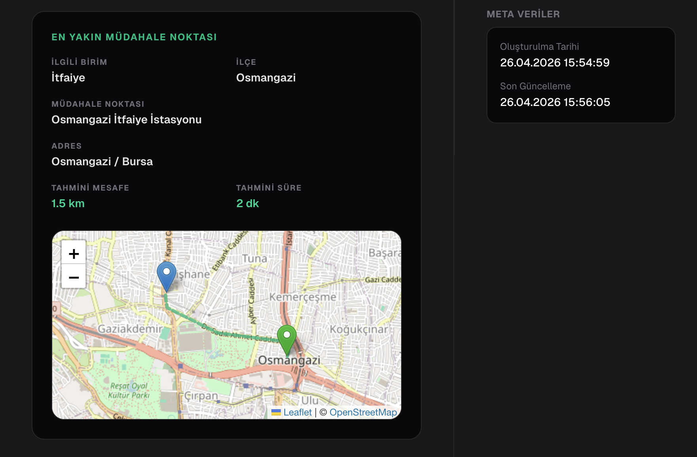

## 🚀 Getting Started

To run BursaMind locally, follow these steps:

1. **Clone the repository**:
   ```bash
   git clone <repository-url>
   cd bursamind
   ```

2. **Install dependencies**:
   ```bash
   npm install
   ```

3. **Configure environment variables**:
   ```bash
   cp .env.example .env.local
   ```
   Fill in your Supabase and Gemini credentials in `.env.local`.

4. **Run the development server**:
   ```bash
   npm run dev
   ```

## 🔑 Environment Variables

The following variables are required in your `.env.local`:

```env
NEXT_PUBLIC_SUPABASE_URL=your_supabase_url
NEXT_PUBLIC_SUPABASE_ANON_KEY=your_supabase_anon_key
SUPABASE_SERVICE_ROLE_KEY=your_service_role_key
GEMINI_API_KEY=your_gemini_api_key
NEXT_PUBLIC_OSRM_BASE_URL=https://router.project-osrm.org
```

- **GEMINI_API_KEY**: Optional. The app will automatically fall back to rule-based keyword analysis if this is missing.
- **OSRM_BASE_URL**: Defaults to the public demo endpoint for MVP/demo purposes.
- **IMPORTANT**: Never commit your `.env.local` file to version control.

## 🗄️ Supabase Setup

1. Create a new project in the [Supabase Dashboard](https://supabase.com).
2. Copy the **Project URL** and **API Keys** into your `.env.local`.
3. Open the **SQL Editor** in Supabase and run the contents of [supabase/full-setup.sql](supabase/full-setup.sql). This will create all necessary tables, triggers, and RLS policies.
4. Create a **Public** storage bucket named `report-images` in the Storage section.
5. In **Authentication -> Providers**, ensure Email is enabled.
6. (Optional) For local testing, you can disable "Confirm email" in the Auth settings to skip email verification.

## 👤 Registration and Demo Accounts

Users can register as either a **Citizen (Vatandaş)** or **Municipality Staff (Belediye Personeli)** directly from the landing page.

### Demo Credentials
- **Citizen**: `citizen@test.com` / `citizen123`
- **Municipality**: `belediye@test.com` / `belediye123`

## 🤖 AI and Risk Analysis

BursaMind features a robust analysis engine:
- **Intelligent Keywords**: Specifically tuned to detect infrastructure issues like water pipe bursts ("boru patlağı") or flooding.
- **Keyboard Tolerance**: The system normalizes Turkish text, handling inputs typed with an English keyboard (e.g., "boru patladi" and "boru patladı" are both correctly identified as high-priority issues).
- **Classification**: Reports are automatically categorized into departments like **BUSKİ (Water & Sewage)**, **Public Works**, or **Fire Department** with calculated risk scores (0-100).

## 📍 Location and Routing

- **Boundary Check**: For MVP purposes, Bursa location validation uses an approximate bounding box.
- **Service Points**: The interventon units (Fire stations, BUSKİ points, etc.) in the `src/lib/location/servicePoints.ts` are sample datasets for demonstration.
- **Routing**: Routing distances and durations are calculated using real-world driving data from the **OSRM public API**.

## 🔒 Security Notes

- **Credential Safety**: `.env.example` provides safe placeholders. Standard project configuration ignores `.env.local`.
- **Row Level Security (RLS)**: The project uses Supabase RLS. The MVP policies are simplified for demonstration; production environments should implement stricter role-based access controls.
- **Admin Approval**: In a production environment, municipality staff accounts should require administrator approval before gaining access to the dashboard.

## 🚀 Future Improvements

- [ ] Implementation of official Bursa province GeoJSON for precise boundary validation.
- [ ] Integration of official municipal service point datasets.
- [ ] Administrator approval workflow for staff registration.
- [ ] Enhanced production-grade RLS policies.
- [ ] Self-hosted OSRM instance for increased reliability.
- [ ] Real-time notification system (Push/SMS/Email).
- [ ] Advanced analytics and heatmaps for long-term urban planning.

## 🚀 Deployment

BursaMind is optimized for deployment on **Vercel**.

### Steps to Deploy:

1. **Push to GitHub**: Push your local repository to a private or public GitHub repository.
2. **Import to Vercel**: Connect your GitHub account to Vercel and import the repository.
3. **Configure Environment Variables**: Add the following keys in your **Vercel Project Settings -> Environment Variables**:
   - `NEXT_PUBLIC_SUPABASE_URL`
   - `NEXT_PUBLIC_SUPABASE_ANON_KEY`
   - `SUPABASE_SERVICE_ROLE_KEY`
   - `GEMINI_API_KEY`
   - `NEXT_PUBLIC_OSRM_BASE_URL` (set to `https://router.project-osrm.org`)
4. **Deploy**: Click "Deploy". Vercel will build and host your application.
5. **Authentication Fix**: If authentication redirects do not work correctly after deployment, ensure you add your Vercel deployment URL (e.g., `https://bursamind.vercel.app`) to the **Additional Redirect URLs** in your **Supabase Dashboard -> Authentication -> URL Configuration**.

## Team & Contributions

BursaMind was developed collaboratively by:

| Team Member | Main Contributions |
|---|---|
| Zeynep Ogulcan | Full-stack development, Supabase database/auth integration, report submission flow, AI-assisted risk analysis logic, OSRM routing integration, municipality and citizen panel development, GitHub preparation |
| Azra Sugeç | UI/UX design support, citizen and municipality workflow planning, dashboard usability review, visual consistency feedback, feature testing, screenshot preparation  |
| Rüya Beste Güngör | Project research support, smart city use-case planning, Bursa location validation, report category testing, municipality response flow review, documentation support, final testing |

All team members contributed to idea development, feature planning, testing, and final presentation preparation. Zeynep Ogulcan focused more on the software implementation and technical integration side of the project.

## 📄 License

Distributed under the MIT License. See `LICENSE` for more information.
